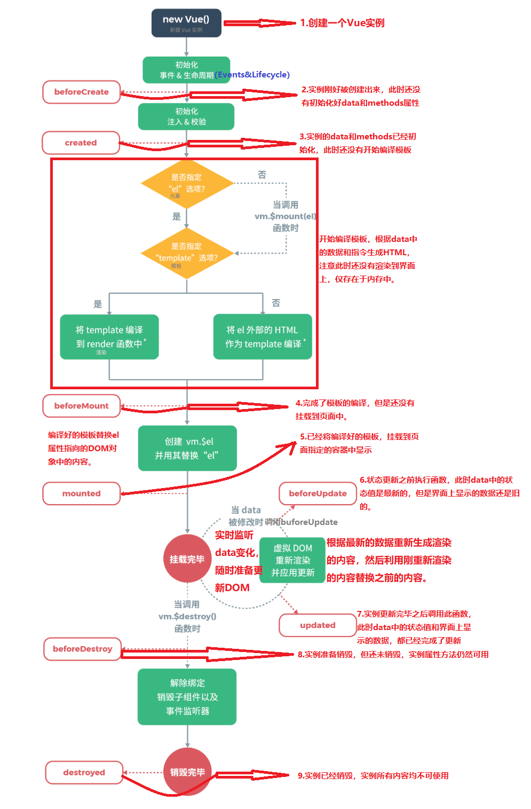

## 5.1计算属性基础知识  

在{{}}中放了太多逻辑会让模板内容难以维护，例如：

```html
<div id="example">
    {{message.split('').reverse().join('')}}
</div>
```

因此，对于任何复杂的逻辑，都应使用计算属性。
计算属性要定义在Vue实例的computed中，计算属性本质上是一个方法。

```html
<!DOCTYPE html>
<html lang="en">

<head>
    <meta charset="UTF-8">
    <meta http-equiv="X-UA-Compatible" content="IE=edge">
    <meta name="viewport" content="width=device-width, initial-scale=1.0">
    <script src="https://cdn.jsdelivr.net/npm/vue@2.7.10/dist/vue.js"></script>
    <title>Document</title>
</head>

<body>
    <div id="app">
        <!-- {{msg.split("").reverse().join('')}} -->
        <!-- 计算属性写法 -->
        {{strMsg}}
    </div>
</body>
<script>
    let vm = new Vue({
        el: '#app',
        data: {
            msg: 'hello world'
        },

        computed: {
            strMsg: function () {
                return this.msg.split("").reverse().join('');
            }
        }
    })
</script>

</html>
```

 以上两种方法结果都一样，计算属性虽然成为属性，但也是用来存数据的（想data选项一样），本质是方法。上面代码中，将定义计算属性的代码改为像属性一样直接赋值是不行的，必须是通过方法返回。</br>
 计算属性一般是用来描述一个属性值依赖于另一个属性值，当用模板语法{{}}将计算属性绑定到页面元素上时，计算属性会在依赖的属性值变化时自动更新DOM元素

 ```html
<!DOCTYPE html>
<html lang="en">

<head>
    <meta charset="UTF-8">
    <meta http-equiv="X-UA-Compatible" content="IE=edge">
    <meta name="viewport" content="width=device-width, initial-scale=1.0">
    <script src="https://cdn.jsdelivr.net/npm/vue@2.7.10/dist/vue.js"></script>
    <title>Document</title>
</head>

<body>
    <div id="app">
        <!-- 这里是通过msg计算出来的值，这样写不是{{}}的使用初衷 -->
        <!-- {{msg.split("").reverse().join('')}} -->
        <!-- 计算属性写法 -->
        <!-- 下面通过计算属性来实现的，strMsg是通过msg计算出来的值 -->
        {{strMsg}}
        <input type="text" v-model="msg">
    </div>
</body>
<script>
    let vm = new Vue({
        el: '#app',
        data: {
            msg: 'hello world'
        },

        computed: {
            strMsg: function () {
                return this.msg.split("").reverse().join('');
            }
        }
    })
</script>

</html>
```

运行后发现通过文本框改变msg的值，计算属性strMsg值也会跟着变化。也就是说，改变计算属性的依赖值就可以改变计算属性的值。

## 5.2 计算属性的组成  

计算属性实际上由get函数和set函数组成，分别用来获取和设置计算属性的值。上面代码实际上就是get函数，即默认写的函数就是get函数，通过get函数可获取到计算属性的值，不过在需要的时候也可提供一个set函数。当然，改变了计算属性的值，set函数就会被执行，也就是通过计算属性的set方法检测到计算属性改变。

```html
<!DOCTYPE html>
<html lang="en">

<head>
    <meta charset="UTF-8">
    <meta http-equiv="X-UA-Compatible" content="IE=edge">
    <meta name="viewport" content="width=device-width, initial-scale=1.0">
    <script src="https://cdn.jsdelivr.net/npm/vue@2.7.10/dist/vue.js"></script>
    <title>Document</title>
</head>

<body>
    <div id="app">
        <!-- {{msg.split("").reverse().join('')}} -->
        <!-- 计算属性写法 -->
        {{strMsg}}
        <input type="text" v-model="msg">
    </div>
</body>
<script>
    let vm = new Vue({
        el: '#app',
        data: {
            msg: 'hello world'
        },

        computed: {
            // 只有一个get函数时的写法
            // strMsg: function () {
            //     return this.msg.split("").reverse().join('');
            // }
            // 有get和set函数时的写法

            strMsg: {
                // 方法名固定为get
                get: function () {
                    return this.msg.split("").reverse().join('');
                },
                // 方法名固定为set，参数newvalue为改变后的计算属性的值
                set: function (newvalue) {
                    console.log("计算属性值被改变了");
                    console.log("改变后的值为" + newvalue);
                }
            }

        }
    })

    console.log(vm.strMsg); //当读取strMsg的值时即会调用get方法
    vm.strMsg = '山川大海'; //当为strMsg设置值时就会调用set方法
</script>

</html>
```

<font color="green" size="3">注意:</font>

    在set方法里不要去直接改变计算属性（strMsg）的值，否则会导致死循环。要想改变计算属性的值，一般是通过改变它的依赖值。

## 5.3 属性计算与方法的对比  

在使用计算属性的时候，是把计算属性的名称直接当作属性来使用，而并不会把计算属性当作一个方法来调用。作为方法调用直接写在{{}}里，方法后面需要跟（）。</br>
为什么要使用一个计算属性而不是定义一个方法呢？
因为，计算属性是基于它们的依赖进行缓存的。即只有在相关依赖发生变化时才会重新求值。方法在计算每次渲染时都会重新执行，这无形中增加了系统的开销。

```html
<!DOCTYPE html>
<html lang="en">

<head>
    <meta charset="UTF-8">
    <meta http-equiv="X-UA-Compatible" content="IE=edge">
    <meta name="viewport" content="width=device-width, initial-scale=1.0">
    <script src="https://cdn.jsdelivr.net/npm/vue@2.7.10/dist/vue.js"></script>
    <title>Document</title>
</head>

<body>
    <div id="app">
        <!-- 计算属性写法 strMsg是通过msg计算出来的值-->
        {{strMsg}} {{strMsg}} {{strMsg}}
        <!-- 如果msg的值不变，则get函数不再执行，因为计算一次后就具有缓存功能 -->
        <br />
        <!-- 通过方法实现,计算每次渲染时都会重新执行方法 -->
        {{strMsg1()}}{{strMsg1()}}{{strMsg1()}}
    </div>
</body>
<script>
    let vm = new Vue({
        el: '#app',
        data: {
            msg: 'hello world'
        },

        methods: {
            // 上面方法调用了三次就执行三次
            strMsg1: function () {
                console.log('执行的是方法' + Date.now());
                return this.msg.split("").reverse().join('');
            }
        },
        computed: {
            strMsg: {
                // 上面调用了三次计算属性只执行一次 具有缓存性
                get: function () {
                    console.log('计算属性' + Date.now());
                    return this.msg.split("").reverse().join('');
                }
            }

        }
    })
</script>

</html>
```

## 5.4监听属性watch  

+ 监听属性watch的基本含义  

监听属性watch也是Vue实例的一个选项，使用watch监听器的方法可以检测某个数据是否发生变化，如果发生变则可以执行一系列业务逻辑操作。</br>

监听器以key-value的形式定义，key是一个字符串，它是需要被检测的对象，而value则可以是字符串（指方法的名称，是通过methods定义好的方法）、函数（通过函数可以获取到监听对象改变前的值以及更新后的值）或是一个对象【对象可以包含回调函数的其他选项，例如是否初始化时执行监听immediate（就是设置为true），或是否执行深度遍历deep,即是否对对象内部的属性进行监听】。value实际上是监听到key变化后执行的回调函数。

+ 回调值为函数  

```html
<!DOCTYPE html>
<html lang="en">

<head>
    <meta charset="UTF-8">
    <meta http-equiv="X-UA-Compatible" content="IE=edge">
    <meta name="viewport" content="width=device-width, initial-scale=1.0">
    <script src="https://cdn.jsdelivr.net/npm/vue@2.7.10/dist/vue.js"></script>
    <title>Document</title>
</head>

<body>
    <div id="app">
        {{msg}}
        <!-- 通过文本框改变msg的值 -->
        <input type="text" v-model="msg">
    </div>
</body>
<script>
    let vm = new Vue({
        el: '#app',
        data: {
            msg: 'hello Vue'
        },

        watch: {
            msg: function (newvalue, oldvalue) {
                console.log(newvalue, oldvalue);
            }
        }
    })
</script>

</html>
```

回调函数的参数newvalue表示被监听属性改变后的值，而oldvalue表示被监听属性改变前的值，监听的回调函数也可以是已在methods中定义好的方法。

```html
<!DOCTYPE html>
<html lang="en">

<head>
    <meta charset="UTF-8">
    <meta http-equiv="X-UA-Compatible" content="IE=edge">
    <meta name="viewport" content="width=device-width, initial-scale=1.0">
    <script src="https://cdn.jsdelivr.net/npm/vue@2.7.10/dist/vue.js"></script>
    <title>Document</title>
</head>

<body>
    <div id="app">
        {{msg}}
        <!-- 通过文本框改变msg的值 -->
        <input type="text" v-model="msg">
    </div>
</body>
<script>
    let vm = new Vue({
        el: '#app',
        data: {
            msg: 'hello Vue'
        },

        methods: {
            watchMsg:function(newvalue, oldvalue) {
               console.log('新值'+ newvalue, '旧值' + oldvalue);
            }
        },
        watch: 'watchMsg' //注意单引号不要漏掉
    })
</script>

</html>
```

+ 回调值为对象  

当监听的回调函数值为一个对象时，不仅可以设置回调函数，还可以设置一些回调函数的属性。

```html
<!DOCTYPE html>
<html lang="en">

<head>
    <meta charset="UTF-8">
    <meta http-equiv="X-UA-Compatible" content="IE=edge">
    <meta name="viewport" content="width=device-width, initial-scale=1.0">
    <script src="https://cdn.jsdelivr.net/npm/vue@2.7.10/dist/vue.js"></script>
    <title>Document</title>
</head>

<body>
    <div id="app">
        用户姓名：<input type="text" v-model="User.name">
    </div>
</body>
<script>
    let vm = new Vue({
        el: '#app',
        data: {
            'User': {
                name: 'zhangsan',
                gender: 'male'
            }
        },

        watch: {
            // 回调值为对象
            'User': {
                handler: function (newvalue, oldvalue) {
                    console.log(`对象记录：新值${newvalue.name}------旧值：${oldvalue.name}`);
                },
                deep: true //设置为深度遍历
            }
        }
    })
</script>

</html>
```

上面代码中监听了User这个对象，也进行了深度遍历。当监听到User.name这个属性发生变化的时候，就可以执行回调函数。需要注意的是，深度遍历默认为false,当不启用深度遍历时，是无法监听到对象内部属性发生的变化的。
这里newvalue和oldvalue是一样的，以为当监听的数据为对象或数组时，newvalue和oldvalue是相等的。因为对象和数组都是引用类型，这两个形参指向的也是一个数据对象（旧值获取不到）。同时，如果不启用深度遍历（deep:false）将无法监听到对象（User）中属性（name）的变化。

## 5.5vm.$watch和watch使用总结  

+ vm.$watch使用  
vm.$watch(data,callback,[options])
第一个参数为要监听的数据，第二个参数为回调，第三个参数为选项，可有可无。
实际上，vm.$watch和watch是一样的，只是写的位置不一样。vm.$watch写在new Vue()外面，watch写在Vue实例对象里面，另外实例方法多个$.

```html
<!DOCTYPE html>
<html lang="en">

<head>
    <meta charset="UTF-8">
    <meta http-equiv="X-UA-Compatible" content="IE=edge">
    <meta name="viewport" content="width=device-width, initial-scale=1.0">
    <script src="https://cdn.jsdelivr.net/npm/vue@2.7.10/dist/vue.js"></script>
    <title>Document</title>
</head>

<body>
    <div id="app"></div>
</body>
<script>
    let vm = new Vue({
        el: '#app',
        data: {
            msg: 'hello Vue'
        }
    })

    // 注意：下面的msg外的单引号不能漏掉，其也可以换成双引号
    vm.$watch('msg', function (newvalue, oldvalue) {
        console.log(newvalue, newvalue);
    })
</script>

</html>
```

+ 计算属性与监听属性watch的使用总结
计算属性的结果会被缓存起来，中有以来的属性发生变化时才会重新计算，必须返回一个数据，主要用来进行纯数据的操作。
</br>
监听属性主要用来监听某个数据的变化，从而去执行某些具体的回调业务逻辑，但不仅仅局限于返回数据。比如，当在数据变化时需要执行异步发送Ajax请求或开销较大的操作时，采用监听器较好。

## 5.6 Vue实例生命周期  

### 5.6.1 Vue实例生命周期基础知识  

在使用Vue时，都会创建一个Vue实例，这个实例不仅是挂载Vue框架的入口，也是MVVM思想中的VM。每个Vue实例在被创建时都要经过一系列的初始化过程。例如，需要设置数据监听、编译模板、将实例挂载到DOM并在数据变化时更新DOM等。在这个过程中，Vue会运行一些生命周期的钩子函数，在钩子函数中可以编写一些自定义方法，用于在Vue的整个生命周期的某些阶段实现特殊需求。

Vue实例声明周期有8个钩子函数，这8个钩子函数都是Vue的实力选项，也就是在new Vue()时都可以设置。8个钩子函数两个一组，分别对应Vue实例的创建，挂载、更新、销毁。



```html
<!DOCTYPE html>
<html lang="en">

<head>
    <meta charset="UTF-8">
    <meta http-equiv="X-UA-Compatible" content="IE=edge">
    <meta name="viewport" content="width=device-width, initial-scale=1.0">
    <script src="https://cdn.jsdelivr.net/npm/vue@2.7.10/dist/vue.js"></script>
    <title>Document</title>
</head>

<body>
    <div id="app">
        {{msg}}
    </div>
</body>
<script>
    let vm = new Vue({
        el: '#app',
        data: {
            msg: '欢迎到来'
        },
        // 所有钩子函数都是Vue实例的一个选项
        beforeCreate() {
            alert('组件实例刚刚被创建，还未进行数据的观测和事件配置')
        },
        created() {
            alert('实例已经创建完成，并且已经进行数据的观测和事件配置')
        },
        beforeMount() {
            alert('模板编译之前，还未挂载')
        },
        mounted() {
            alert('模板编译之后，已经挂载，此时才会渲染页面，才会看到页面上数据展示')
        },
        beforeUpdate() {
            alert('数据更新之前')
        },
        update () {
            alert('数据更新之后')
        },
        beforeDestroy() {
            alert('组件销毁之前')
        },
        destroyed() {
            alert('组件销毁之后')
        }
        // 上面钩子函数的执行顺序与书写顺序无关
    })
</script>

</html>
```

运行前面的4个钩子函数依次执行，后面的4个未执行，以为没有更新组件也没销毁组件。

```html
<!DOCTYPE html>
<html lang="en">

<head>
    <meta charset="UTF-8">
    <meta http-equiv="X-UA-Compatible" content="IE=edge">
    <meta name="viewport" content="width=device-width, initial-scale=1.0">
    <script src="https://cdn.jsdelivr.net/npm/vue@2.7.10/dist/vue.js"></script>
    <title>Document</title>
</head>

<body>
    <div id="app">
        {{msg}}

        <input type="button" value="更新组件" @click="update">
        <input type="button" value="销毁组件" @click="destroy">
    </div>
</body>
<script>
    let vm = new Vue({
        el: '#app',
        data: {
            msg: '欢迎到来'
        },
        methods: {
            update() {
                this.msg = "welcome to Vue world"
            },
            destroy() {
                this.$destroy(); //组件销毁，占用的空间都被收回
            }
        },
        // 所有钩子函数都是Vue实例的一个选项
        beforeCreate() {
            alert('组件实例刚刚被创建，还未进行数据的观测和事件配置')
        },
        created() {
            alert('实例已经创建完成，并且已经进行数据的观测和事件配置')
        },
        beforeMount() {
            alert('模板编译之前，还未挂载')
        },
        mounted() {
            alert('模板编译之后，已经挂载，此时才会渲染页面，才会看到页面上数据展示')
        },
        beforeUpdate() {
            alert('数据更新之前')
        },
        update() {
            alert('数据更新之后')
        },
        beforeDestroy() {
            alert('组件销毁之前')
        },
        destroyed() {
            alert('组件销毁之后')
        }
        // 上面钩子函数的执行顺序与书写顺序无关
    })
</script>

</html>
```

单机【更新组件】按钮会执行beforeUpdate和update两个钩子。单机【销毁组件】会执行beforeDestroy和destroyed两个钩子函数，销毁之后，单机【更新组件】就不再有反应了。

+ 钩子函数beforeCreate & created示例
通过new Vue() 创建了一个Vue实例之后会执行init方法，此时只会初始化Vue实例所包含的一些默认的事件与生命周期函数，在这个实例还未被完全创建之前，则会执行beforeCreated钩子函数。

```html
<!DOCTYPE html>
<html lang="en">

<head>
    <meta charset="UTF-8">
    <meta http-equiv="X-UA-Compatible" content="IE=edge">
    <meta name="viewport" content="width=device-width, initial-scale=1.0">
    <script src="https://cdn.jsdelivr.net/npm/vue@2.7.10/dist/vue.js"></script>
    <title>Document</title>
</head>

<body>
    <div id="app"></div>
</body>
<script>
    let vm = new Vue({
        el: '#app',
        data: {
            msg: 'hello word'
        },
        methods: {
            show() {
                console.log('show方法执行了');
            },
        },
        beforeCreate() {
            console.log(`Vue示例挂载对象el:${this.$el}`);
            console.log(`Vue实例的data对象：${this.$data}`);
            console.log(`Vue实例的msg属性值：${this.msg}`);
            console.log(`Vue实例的methods对象：${this.$options.methods}`);
            this.show();
        },

    })
</script>

</html>
```

在控制台可以看到，此时Vue实例中的挂载点元素、data、msg在beforeCreated钩子函数执行时，都没有进行初始化，methods对象产生了，但里面的方法不能使用。

<font color="green" size="4">注意:</font>

    显示hello word  是因为Vue实例已经创建完成了。并未阻止创建Vue实例时前面四个生命周期的自动执行。要观察Vue实例生命周期每个阶段执行什么，需要在控制台中编写代码。

```html
<!DOCTYPE html>
<html lang="en">

<head>
    <meta charset="UTF-8">
    <meta http-equiv="X-UA-Compatible" content="IE=edge">
    <meta name="viewport" content="width=device-width, initial-scale=1.0">
    <script src="https://cdn.jsdelivr.net/npm/vue@2.7.10/dist/vue.js"></script>
    <title>Document</title>
</head>

<body>
    <div id="app"></div>
</body>
<script>
    let vm = new Vue({
        el: '#app',
        data: {
            msg: 'hello word'
        },
        methods: {
            show() {
                console.log('show方法执行了');
            },
        },
        created() {
            console.log(`Vue示例挂载对象el:${this.$el}`);
            console.log(`Vue实例的data对象：${this.$data}`);
            console.log(`Vue实例的msg属性值：${this.msg}`);
            console.log(`Vue实例的methods对象：${this.$options.methods}`);
            this.show();
        },

    })
</script>

</html>
```

从控制台信息可以看出，在执行created钩子函数过程中，msg和方法show已经初始化完成，此时整个Vue实例已经初始化完成。但Vue实例的挂载点元素还没有进行初始化。也就是说，当执行完created钩子函数之后，Vue实例与View（视图层）之间依旧处于隔离状态，created钩子函数初始化完成的Vue实例依旧没有与DOM进行绑定。

+ 钩子函数beforeMount & mounted 示例
当Vue实例执行完beforeCreated、created钩子函数之后，Vue实例已经初始化完成，但并没有挂载到页面DOM上。在挂载到页面DOM元素之前，需要执行beforeMount钩子函数将实例捆绑在模板上进行编译渲染。

```html
<!DOCTYPE html>
<html lang="en">

<head>
    <meta charset="UTF-8">
    <meta http-equiv="X-UA-Compatible" content="IE=edge">
    <meta name="viewport" content="width=device-width, initial-scale=1.0">
    <script src="https://cdn.jsdelivr.net/npm/vue@2.7.10/dist/vue.js"></script>
    <title>Document</title>
</head>

<body>
    <div id="app">
        <h3 id="h3">{{msg}}</h3>
    </div>
</body>
<script>
    let vm = new Vue({
        el: '#app',
        data: {
            msg: 'hello word'
        },
        methods: {
            show() {
                console.log('执行了show方法');
            }
        },
        beforeMount() {
            console.log(document.getElementById('h3').innerText);
        }

    })
</script>

</html>
```

控制台输出信息能获取到h3元素，也就是当执行到beforeMount钩子时，已经将模板编译完成，但未挂载到页面上。

当把编译的模板挂载到页面上时，需要执行mounted钩子函数，在这个阶段，用户就可以看到已经渲染好的页面了。

```html
<!DOCTYPE html>
<html lang="en">

<head>
    <meta charset="UTF-8">
    <meta http-equiv="X-UA-Compatible" content="IE=edge">
    <meta name="viewport" content="width=device-width, initial-scale=1.0">
    <script src="https://cdn.jsdelivr.net/npm/vue@2.7.10/dist/vue.js"></script>
    <title>Document</title>
</head>

<body>
    <div id="app">
        <h3 id="h3">{{msg}}</h3>
    </div>
</body>
<script>
    let vm = new Vue({
        el: '#app',
        data: {
            msg: 'hello word'
        },
        methods: {
            show() {
                console.log('执行了show方法');
            }
        },
        mounted() {
            console.log(document.getElementById('h3').innerText);
        }

    })
</script>

</html>
```

上面代码可以看出，mounted时创建Vue实例过程中的最后一个钩子函数，当执行完mounted钩子之后，实例已经创建完成，并渲染到页面中。

+ 钩子函数 beforeUpdate & updated示例
在执行完mounted钩子函数之后，Vue实例已经脱离了实例创建阶段，进入了实例的运行阶段。此时，对实例的data进行修改时，会触发 beforeUpdate、update 这两个钩子函数。

```html
<!DOCTYPE html>
<html lang="en">

<head>
    <meta charset="UTF-8">
    <meta http-equiv="X-UA-Compatible" content="IE=edge">
    <meta name="viewport" content="width=device-width, initial-scale=1.0">
    <script src="https://cdn.jsdelivr.net/npm/vue@2.7.10/dist/vue.js"></script>
    <title>Document</title>
</head>

<body>
    <div id="app">
        <h3 id="h3">{{msg}}</h3>
    </div>
</body>
<script>
    let vm = new Vue({
        el: '#app',
        data: {
            msg: 'hello word'
        },
        methods: {
            show() {
                console.log('执行了show方法');
            }
        },
        beforeUpdate() {
            console.log(`页面上的数据：${document.getElementById('h3').innerText}`);
            console.log(`data中msg的数据：${this.msg}`);
        }

    })
</script>

</html>
```

在控制台对msg的值进行修改时，在执行 beforeUpdate钩子函数时，页面上的数据还是旧的，而data中msg属性已经将值修改成了最新的值

```html
<!DOCTYPE html>
<html lang="en">

<head>
    <meta charset="UTF-8">
    <meta http-equiv="X-UA-Compatible" content="IE=edge">
    <meta name="viewport" content="width=device-width, initial-scale=1.0">
    <script src="https://cdn.jsdelivr.net/npm/vue@2.7.10/dist/vue.js"></script>
    <title>Document</title>
</head>

<body>
    <div id="app">
        <h3 id="h3">{{msg}}</h3>
    </div>
</body>
<script>
    let vm = new Vue({
        el: '#app',
        data: {
            msg: 'hello word'
        },
        methods: {
            show() {
                console.log('执行了show方法');
            }
        },
        update() {
            console.log(`页面上的数据：${document.getElementById('h3').innerText}`);
            console.log(`data中msg的数据：${this.msg}`);
        }

    })
</script>

</html>
```

当 update 钩子函数执行的时候，页和data中的数据已经完成了同步，显示的都是最新的数据，此时，整个页面数据实时变更的操作也已经完成了。

+ 钩子函数 beforeDestroy & destroyed 示例
既然Vue实例会有创建，那么在不需要的时候Vue实例也会将这个实例进行销毁， beforeDestroy 和 destroyed 钩子函数可以实现这一目的。

```html
<!DOCTYPE html>
<html lang="en">

<head>
    <meta charset="UTF-8">
    <meta http-equiv="X-UA-Compatible" content="IE=edge">
    <meta name="viewport" content="width=device-width, initial-scale=1.0">
    <script src="https://cdn.jsdelivr.net/npm/vue@2.7.10/dist/vue.js"></script>
    <title>Document</title>
</head>

<body>
    <div id="app"></div>
</body>
<script>
    let vm = new Vue({
        el: '#app',
        data: {
            msg: 'hello word'
        },
        methods: {
            show() {
                console.log('show方法执行了');
            },
        },
        beforeDestroy() {
            console.log(`Vue示例挂载对象el:${this.$el}`);
            console.log(`Vue实例的data对象：${this.$data}`);
            console.log(`Vue实例的msg属性值：${this.msg}`);
            console.log(`Vue实例的methods对象：${this.$options.methods}`);
            this.show();
        },
        destroyed() {
            console.log(`Vue示例挂载对象el:${this.$el}`);
            console.log(`Vue实例的data对象：${this.$data}`);
            console.log(`Vue实例的msg属性值：${this.msg}`);
            console.log(`Vue实例的methods对象：${this.$options.methods}`);
            this.show();
        },
    })
</script>

</html>
```

